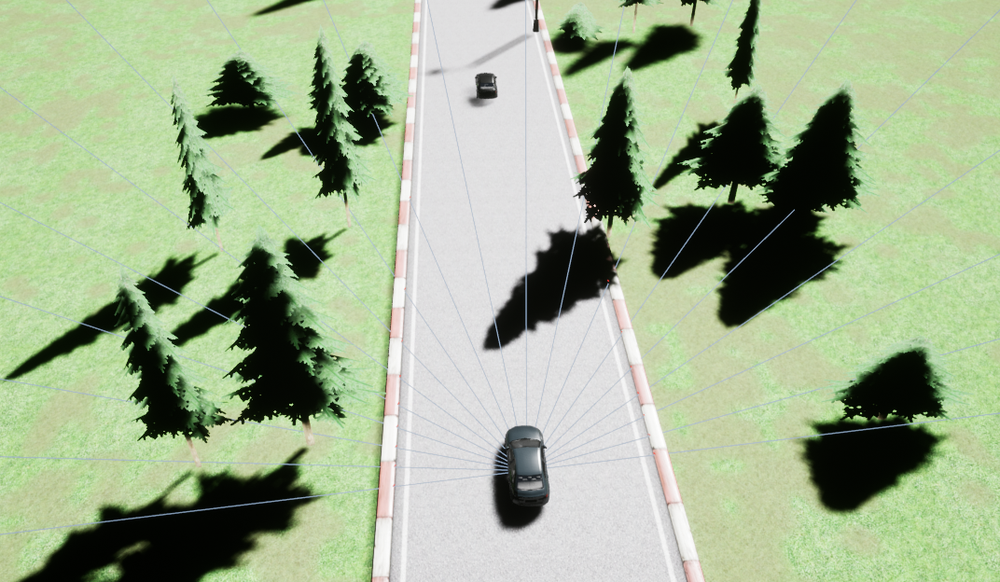
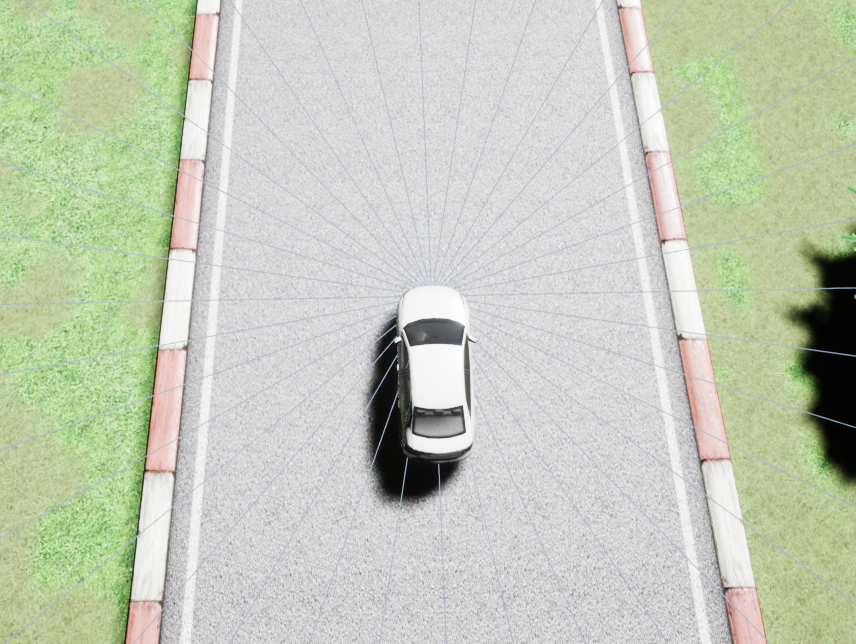
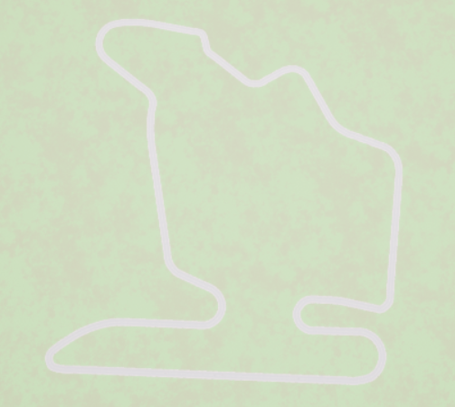

# About Sensors

## Track Sensor

A sensor to get track information. Covers 180 degrees of the vehicle's front. 19 returns with maximum of 200m range. 

    track_sensor.get_measurements()

## Opponent Sensor

A sensor that only detects other vehicles. 36 return from 360 degrees with 200m range. 

    opponents_sensor.get_measurements()

## Road Deviation Sensor

Measures the following

- Deviation from the center of the road in meters **track_pos**

- Deviation from road orientation in radians **angle**

    vehicle.get_road_deviation_info()

## Vehicle State Measurements

Vehicle state measurements include

- Global Posisition
- Global Orientation
- Velocity
- Acceleration
- Angular Acceleration

# Multi Agent Structure

In order to add another vehicle at desired velocity the following API call can be used. 

            client.spawn_vehicle(actor= main_vehicle,distance=agent_rel_pos,initial_speed=0,set_speed=30)

- **actor** : the actor that this new agent is going to be located relatively. If left empty, then track start location is taken as reference. 

- **distance** : relative distance to reference object. In meters.

- **initial_speed** : initial speed in km/h.

- **set_speed** : the target speed that the agent will try to maintain. km/h.

For convinience, an example agent addition has been added to simstarEnv.py. The parameters are 
 - **add_agent** : Default **False**
 - **agent_set_speed** : Default **30**
 - **agent_rel_pos** : Default **50**

## Controlling Multiple Vehicles By API

There are multiple ways of controlling a vehicle by another script using the API. Any client can be initiated and simstar observations can be created seperately. An example of this is provided in the environment. To test this feature, set the **autopilot_agent** flag to true. 

To control the other agent, get obervations

    observation_other_agent = env.get_agent_obs()

Then select the action accoirdin to this obervation

    other_vehicle_action = rl_agent.action(observation_other_agent)

Finally, apply this action to other agent as 

    env.set_agent_action(other_vehicle_action)

# Faster Simulation

You can enable faster simulation with the flag **speed_up** in the environment. Consider using Syncronous Mode when doing faster simulation.

# Syncronous Mode

If enabled, this mode allows perfect synronization. In the provided environment, **synronized_mode** flag can be made **True** to start this mode. 

Parameters in this mode 

- hz: Frequency of sampling from the environment. The environment will respond this many time in a second and will not return an _observation_ until given number of frames are paseed in the simulator. Please note that, from version v1.5.3.B and onward, **Simstar** comes with a fixed frame rate of 60 fps. Therefore you should consider choosing a factor of 60 when choosin hz. 

- speed_up: This speeds up the simulation safely until **-5x**. Again consider _hz_ and *speed_up* with the fixed FPS of the environment 60 fps. speed_up*hz should be a factpr of 60.  

- timeout. Sync Simulation blocks the simluator completely, even a new connection cannot be made. There is a default 30 seconds timeout. You can change this via

    client.set_sync_timeout(NewValue)
    
# No Rendering Mode

In order to disable rendering, there are two options. 

1. You can Press "X" in Simstar window. 

2. You can run Simstar with the command line argument

Linux:

    ./SimStar.sh -no-render-simstar=1

Windows:

    SimStar.exe -no-render-simstar=1

3. You can start Simstar **Witout a Window**. In this mode, there is no way to see the simulation. You have to restart simualtion without the below parameter. 
    
Linux:

    ./SimStar.sh -nullrhi

Windows:

    SimStar.exe -nullrhi

# Change default port

Default Simstar port is 8080. You can change default port with command line argument.

    ./SimStar.sh -api-port=8081

# Change Track Type

There are 2 tracks provided as training tracks and one track provided as validation track. Change of the track can be made by passing the track name as a parameter to environment

Available tracks

- Austria Grand Prix [Validation]

- Dutch Grand Prix [Train]

- Hungarian Grand Prix [Train]

Example track start:

    SimstarEnv(track_name=simstar.TrackName.Austria)

Hungary Grand Prix track. 