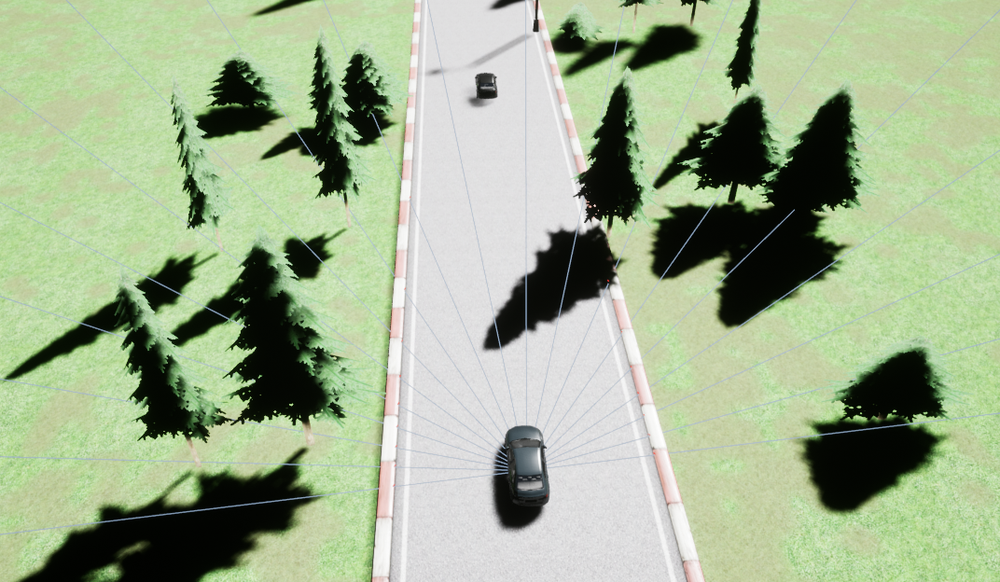

# About Sensors

## Track Sensor

A sensor to get track information. Covers 180 degrees of the vehicle's front. 19 returns with maximum of 200m range. 

    track_sensor.get_measurements()

## Opponent Sensor

A sensor that only detects other vehicles. 36 return from 360 degrees with 200m range. 

    opponents_sensor.get_measurements()

## Road Deviation Sensor

Measures the following

- Deviation from the center of the road in meters

- Deviation from road orientation in radians

    vehicle.get_road_deviation_info()

## Vehicle State Measurements

Vehicle state measurements include

- Global Posisition
- Global Orientation
- Velocity
- Acceleration
- Angular Acceleration
