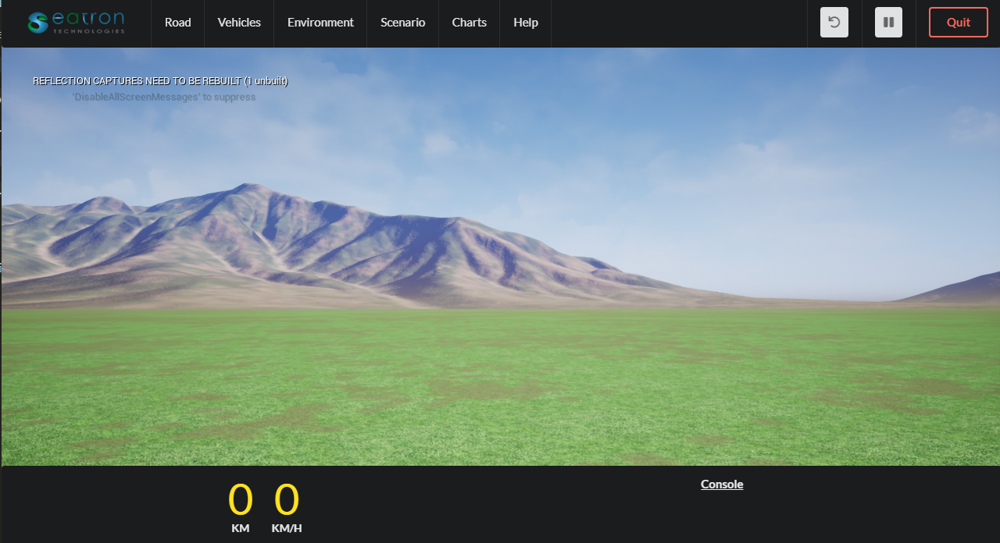

# simstar_env

Download Simstar from the link:

https://drive.google.com/open?id=1Gp-XXnOX9dbDcfqFJNJ4UtZqo9sWqjUg

### Windows 
just click on Simstar.exe and Simstar is ready

### Linux 
    cd Simstar
  
    chmod 777 -R *
  
    ./Simstar.sh

## Requirements

### Python Package Requirements

#### Option 1: Install using Anaconda
Create a new environment using anaconda. 

	conda env create --file environment.yml

	conda activate blg604final

#### Option 2: Manual Installation
	
Install required python libraries from requirements.txt by

	pip install -r requirements.txt

Then install **pytorch** with minimum version 1.3.0

## Install Python API

      cd PythonAPI

      python setup.py install

## Installation Test

There are multiple stages that needs to be checked. 

### 1. Test Simstar Executable

Open the simstar executable, allow for networking if asked. 

### 2. Test PythonAPI installation

Run the following with success.

	cd PythonAPI

	python python_api_intro.py

### 3. Test Environment Setup

	cd GymEnv

	python example_experiment.py

### Optional Test

To test a closed loop training with Pytorch, you can run the example DDPG agent from examples folder.

